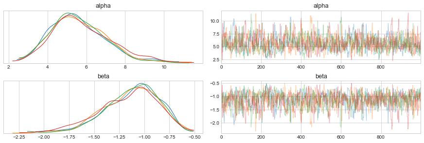

# Ch 1. Regression Models


```python
import pystan
from matplotlib import pyplot as plt
import arviz as az
import numpy as np

plt.style.use('seaborn-whitegrid')
plt.rcParams['figure.figsize'] = (8.0, 5.0)
plt.rcParams['axes.titlesize'] = 18
plt.rcParams['axes.labelsize'] = 15
```

## 1.1 Linear Regression

Mathematical notation of standard linear regression.

$$
y_n = \alpha + \beta x_n + \epsilon_n \quad \text{where} \quad \epsilon_n \sim N(0, \sigma) \\
y_n \sim N(\alpha + \beta X_n, \sigma)
$$

This is shown in Stan below.

```c
data {
    int<lower=0> N;
    vector[N] x;
    vector[N] y;
}

parameters {
    real alpha;
    real beta;
    real<lower=0> sigma;
}

model {
    y ~ normal(alpha + beta * x, sigma);
}
```

Note that the model is vectorized such that each data point is not iterated over as shown below.
The vectorized version is not only easier to read, but runs faster, too.

```c
model {
    for (n in 1:N)
        y[n] ~ normal(alpha + beta * x[n], sigma)
}
```

This vectorization along with overloading the arithmetic operators allows for easy use of matrix in the models, too.

```c
data {
    int<lower=0> N;  // number of data points
    int<lower=0> K;  // number of predictors (columns)
    matrix[N, K] x;  // predictor matrix
    vector[N] y;     // outcome vector
}

parameters {
    real alpha;
    vector[K] beta;
    real<lower=0> sigma;
}

model {
    y ~ normal(x * beta + alpha, sigma)
}
```

### Example

An example of a simple linear regression.
The Stan model is available in [stan-models/ch01_regression-models_linear-reg.stan](stan-models/ch01_regression-models_linear-reg.stan)


```python
np.random.seed(123)

N = 100
alpha_real = 5.0
beta_real = 2.5
sigma_real = 3.0

x = np.random.uniform(0, 10, N)
y = alpha_real + beta_real * x + np.random.normal(0, sigma_real, N)

plt.plot(x, y, 'ko')
plt.xlabel('x')
plt.ylabel('y')
plt.show()
```


```python
lm_m1_data = {
    'N': N,
    'x': x,
    'y': y
}

lm_m1 = pystan.StanModel(file='stan-models/ch01_regression-models_linear-reg.stan')
```

    INFO:pystan:COMPILING THE C++ CODE FOR MODEL anon_model_811f32dcbac7f45107073d98cec5a743 NOW.


```python
lm_m1_fit = lm_m1.sampling(data=lm_m1_data, iter=1000, chains=4)
```


```python
az_lm_m1_fit = az.from_pystan(lm_m1_fit, posterior_model=lm_m1_fit)
az.plot_trace(az_lm_m1_fit)
plt.show()
```

    /usr/local/Caskroom/miniconda/base/envs/stan-user-guide-notes/lib/python3.7/site-packages/arviz/plots/backends/matplotlib/distplot.py:38: UserWarning: Argument backend_kwargs has not effect in matplotlib.plot_distSupplied value won't be used
      "Argument backend_kwargs has not effect in matplotlib.plot_dist"
    /usr/local/Caskroom/miniconda/base/envs/stan-user-guide-notes/lib/python3.7/site-packages/arviz/plots/backends/matplotlib/distplot.py:38: UserWarning: Argument backend_kwargs has not effect in matplotlib.plot_distSupplied value won't be used
      "Argument backend_kwargs has not effect in matplotlib.plot_dist"
    /usr/local/Caskroom/miniconda/base/envs/stan-user-guide-notes/lib/python3.7/site-packages/arviz/plots/backends/matplotlib/distplot.py:38: UserWarning: Argument backend_kwargs has not effect in matplotlib.plot_distSupplied value won't be used
      "Argument backend_kwargs has not effect in matplotlib.plot_dist"
    /usr/local/Caskroom/miniconda/base/envs/stan-user-guide-notes/lib/python3.7/site-packages/arviz/plots/backends/matplotlib/distplot.py:38: UserWarning: Argument backend_kwargs has not effect in matplotlib.plot_distSupplied value won't be used
      "Argument backend_kwargs has not effect in matplotlib.plot_dist"
    /usr/local/Caskroom/miniconda/base/envs/stan-user-guide-notes/lib/python3.7/site-packages/arviz/plots/backends/matplotlib/distplot.py:38: UserWarning: Argument backend_kwargs has not effect in matplotlib.plot_distSupplied value won't be used
      "Argument backend_kwargs has not effect in matplotlib.plot_dist"
    /usr/local/Caskroom/miniconda/base/envs/stan-user-guide-notes/lib/python3.7/site-packages/arviz/plots/backends/matplotlib/distplot.py:38: UserWarning: Argument backend_kwargs has not effect in matplotlib.plot_distSupplied value won't be used
      "Argument backend_kwargs has not effect in matplotlib.plot_dist"
    /usr/local/Caskroom/miniconda/base/envs/stan-user-guide-notes/lib/python3.7/site-packages/arviz/plots/backends/matplotlib/distplot.py:38: UserWarning: Argument backend_kwargs has not effect in matplotlib.plot_distSupplied value won't be used
      "Argument backend_kwargs has not effect in matplotlib.plot_dist"
    /usr/local/Caskroom/miniconda/base/envs/stan-user-guide-notes/lib/python3.7/site-packages/arviz/plots/backends/matplotlib/distplot.py:38: UserWarning: Argument backend_kwargs has not effect in matplotlib.plot_distSupplied value won't be used
      "Argument backend_kwargs has not effect in matplotlib.plot_dist"
    /usr/local/Caskroom/miniconda/base/envs/stan-user-guide-notes/lib/python3.7/site-packages/arviz/plots/backends/matplotlib/distplot.py:38: UserWarning: Argument backend_kwargs has not effect in matplotlib.plot_distSupplied value won't be used
      "Argument backend_kwargs has not effect in matplotlib.plot_dist"
    /usr/local/Caskroom/miniconda/base/envs/stan-user-guide-notes/lib/python3.7/site-packages/arviz/plots/backends/matplotlib/distplot.py:38: UserWarning: Argument backend_kwargs has not effect in matplotlib.plot_distSupplied value won't be used
      "Argument backend_kwargs has not effect in matplotlib.plot_dist"
    /usr/local/Caskroom/miniconda/base/envs/stan-user-guide-notes/lib/python3.7/site-packages/arviz/plots/backends/matplotlib/distplot.py:38: UserWarning: Argument backend_kwargs has not effect in matplotlib.plot_distSupplied value won't be used
      "Argument backend_kwargs has not effect in matplotlib.plot_dist"
    /usr/local/Caskroom/miniconda/base/envs/stan-user-guide-notes/lib/python3.7/site-packages/arviz/plots/backends/matplotlib/distplot.py:38: UserWarning: Argument backend_kwargs has not effect in matplotlib.plot_distSupplied value won't be used
      "Argument backend_kwargs has not effect in matplotlib.plot_dist"


## 1.2 The QR Reparameterization

QR decomposition can be used to reparameterize $x \beta$ when there are more than one predictors $K$ and there are more data points $N$ than predcitors, $N \geq K$.
If these conditions are satisfied, then the reparamerterization is $x = QR$ where $Q$ is an orthogonal matrix and $R$ is an upper-triangular matrix.

This method is recommended for linear and generalized linear models whenever $K \gt 1$ and there are no informative priors on the location of $\beta$.

The functions `qr_Q()` and `qr_R()` implement the $QR$ decomposition.
In practice, it is recommended to use $x = Q^* R^*$ where $Q^* = Q \times \sqrt{n-1}$ and $R^* = \frac{R}{\sqrt{n-1}$ where $n$ is the number of data points.

The overall reparameterization is: $\eta = x \beta = QR \beta = Q^* R^* \beta$.
If we let $\theta = R^* \beta$ then $\eta = Q^* \theta$ and $\beta = R^{*-1} \theta$.

```c
data {
    int<lower=0> N;
    int<lower=0> K;
    matrix[N, K] x;
    vector[N] y;
}
transformed data {
    matrix[N, K] Q_ast;
    matrix[K, K] R_ast;
    matrix[K, K] R_ast_inverse;
    
    Q_ast = qr_Q(x)[, 1:K] * sqrt(N - 1);
    R_ast = qr_R(x)[1:K, ] / sqrt(N - 1);
    R_ast_inverse = inverse(R_ast);
}
parameters {
    real alpha;
    vector[k] theta;
    real<lower=0> sigma;
}
model {
    y ~ normal(Q_ast * theta + alpha, sigma);
}
generated quantities {
    vector[K] = beta;
    beta = R_ast_inverse * theta;
}
```

## 1.3 Priors for Coefficients and Scales

This topic is dicussed in other chapters.

## 1.4 Robust Noise Models

Robust regression can be accomidated by using a Student-*t* distribution for the noise of a linear model.
This is demonstrated below using $\nu$ as the degrees of freedom (a.k.a "shape") of the distribution.

```c
data {
    ...
    real<lower=0> nu;
}
...
model {
    y ~ student_t(nu, alpha + beta * x, sigma);
}
```

## 1.5 Logistic and Probit Regression

Generalized linear models with sigmoid-shaped link functions that map linear predictions $(-\infty, \infty)$ to probability values $(0, 1)$.

Below is an example of a logisitic regression model with one predictor and an intercept.

```c
data {
    int<lower=0> N;
    vector[N] x;
    int<lower=0, upper=1> y[N];
}
parameters {
    real alpha;
    real beta;
}
model {
    y ~ bernoulli_logit(alpha + beta * x);
}
```

Probit regression uses the cumulative normal distribution function.

$$
\Phi(x) = \int_{-\infty}^{x} N(y | 0,1) \text{ d}y 
$$

This is implemented in Stan as the `Phi()` function (or the faster approximation `Phi_approx()`).

```c
model {
    y ~ bernoulli(Phi(alpha + beta * x));
}
```

### Example


```python
np.random.seed(123)

N = 100

alpha = 2.0

g1_mean = 10.0
g1_sigma = 3.0

g2_mean = 0.0
g2_sigma = 3.0

x1 = np.random.normal(g1_mean, g1_sigma, int(N / 2.0))
x2 = np.random.normal(g2_mean, g2_sigma, int(N / 2.0))
x = np.concatenate((x1, x2))

y = np.concatenate((np.repeat(0, N / 2), np.repeat(1, N / 2))).astype(np.int)

plt.plot(x, y, 'bo', alpha = 0.5)
plt.xlabel('x')
plt.ylabel('y')
plt.title('Data for logisitic regression')
plt.show()
```


```python
logreg_data = {
    'N': N,
    'x': x,
    'y': y
}
```

The Stan code is available in [stan-models/ch01_regression-models_logistic-reg.stan](stan-models/ch01_regression-models_logistic-reg.stan).


```python
m_logreg = pystan.StanModel(file='stan-models/ch01_regression-models_logistic-reg.stan')
```

    INFO:pystan:COMPILING THE C++ CODE FOR MODEL anon_model_f46cac6794bd18b9d014a889ac31276b NOW.


```python
m_logreg_fit = m_logreg.sampling(data=logreg_data, iter=2000, chains=4)
```


```python
az_logreg_fit = az.from_pystan(m_logreg_fit, posterior_model=m_logreg)
az.plot_trace(az_logreg_fit)
plt.show()
```

    /usr/local/Caskroom/miniconda/base/envs/stan-user-guide-notes/lib/python3.7/site-packages/arviz/plots/backends/matplotlib/distplot.py:38: UserWarning: Argument backend_kwargs has not effect in matplotlib.plot_distSupplied value won't be used
      "Argument backend_kwargs has not effect in matplotlib.plot_dist"
    /usr/local/Caskroom/miniconda/base/envs/stan-user-guide-notes/lib/python3.7/site-packages/arviz/plots/backends/matplotlib/distplot.py:38: UserWarning: Argument backend_kwargs has not effect in matplotlib.plot_distSupplied value won't be used
      "Argument backend_kwargs has not effect in matplotlib.plot_dist"
    /usr/local/Caskroom/miniconda/base/envs/stan-user-guide-notes/lib/python3.7/site-packages/arviz/plots/backends/matplotlib/distplot.py:38: UserWarning: Argument backend_kwargs has not effect in matplotlib.plot_distSupplied value won't be used
      "Argument backend_kwargs has not effect in matplotlib.plot_dist"
    /usr/local/Caskroom/miniconda/base/envs/stan-user-guide-notes/lib/python3.7/site-packages/arviz/plots/backends/matplotlib/distplot.py:38: UserWarning: Argument backend_kwargs has not effect in matplotlib.plot_distSupplied value won't be used
      "Argument backend_kwargs has not effect in matplotlib.plot_dist"
    /usr/local/Caskroom/miniconda/base/envs/stan-user-guide-notes/lib/python3.7/site-packages/arviz/plots/backends/matplotlib/distplot.py:38: UserWarning: Argument backend_kwargs has not effect in matplotlib.plot_distSupplied value won't be used
      "Argument backend_kwargs has not effect in matplotlib.plot_dist"
    /usr/local/Caskroom/miniconda/base/envs/stan-user-guide-notes/lib/python3.7/site-packages/arviz/plots/backends/matplotlib/distplot.py:38: UserWarning: Argument backend_kwargs has not effect in matplotlib.plot_distSupplied value won't be used
      "Argument backend_kwargs has not effect in matplotlib.plot_dist"
    /usr/local/Caskroom/miniconda/base/envs/stan-user-guide-notes/lib/python3.7/site-packages/arviz/plots/backends/matplotlib/distplot.py:38: UserWarning: Argument backend_kwargs has not effect in matplotlib.plot_distSupplied value won't be used
      "Argument backend_kwargs has not effect in matplotlib.plot_dist"
    /usr/local/Caskroom/miniconda/base/envs/stan-user-guide-notes/lib/python3.7/site-packages/arviz/plots/backends/matplotlib/distplot.py:38: UserWarning: Argument backend_kwargs has not effect in matplotlib.plot_distSupplied value won't be used
      "Argument backend_kwargs has not effect in matplotlib.plot_dist"





```python
az.summary(az_logreg_fit)
```


<div>
<style scoped>
    .dataframe tbody tr th:only-of-type {
        vertical-align: middle;
    }

    .dataframe tbody tr th {
        vertical-align: top;
    }

    .dataframe thead th {
        text-align: right;
    }
</style>
<table border="1" class="dataframe">
  <thead>
    <tr style="text-align: right;">
      <th></th>
      <th>mean</th>
      <th>sd</th>
      <th>hpd_3%</th>
      <th>hpd_97%</th>
      <th>mcse_mean</th>
      <th>mcse_sd</th>
      <th>ess_mean</th>
      <th>ess_sd</th>
      <th>ess_bulk</th>
      <th>ess_tail</th>
      <th>r_hat</th>
    </tr>
  </thead>
  <tbody>
    <tr>
      <th>alpha</th>
      <td>5.670</td>
      <td>1.468</td>
      <td>3.007</td>
      <td>8.331</td>
      <td>0.051</td>
      <td>0.037</td>
      <td>818.0</td>
      <td>803.0</td>
      <td>835.0</td>
      <td>1029.0</td>
      <td>1.00</td>
    </tr>
    <tr>
      <th>beta</th>
      <td>-1.139</td>
      <td>0.284</td>
      <td>-1.661</td>
      <td>-0.651</td>
      <td>0.010</td>
      <td>0.007</td>
      <td>812.0</td>
      <td>800.0</td>
      <td>823.0</td>
      <td>967.0</td>
      <td>1.01</td>
    </tr>
  </tbody>
</table>
</div>


```python
m_logreg_fit
```


    Inference for Stan model: anon_model_f46cac6794bd18b9d014a889ac31276b.
    4 chains, each with iter=2000; warmup=1000; thin=1; 
    post-warmup draws per chain=1000, total post-warmup draws=4000.
    
            mean se_mean     sd   2.5%    25%    50%    75%  97.5%  n_eff   Rhat
    alpha   5.67    0.05   1.47   3.21   4.63   5.48   6.58   9.21    811    1.0
    beta   -1.14    0.01   0.28   -1.8  -1.32   -1.1  -0.94  -0.68    805    1.0
    lp__  -17.24    0.03   1.06 -20.12 -17.67 -16.92  -16.5 -16.21   1095   1.01
    
    Samples were drawn using NUTS at Fri Aug 21 08:16:37 2020.
    For each parameter, n_eff is a crude measure of effective sample size,
    and Rhat is the potential scale reduction factor on split chains (at 
    convergence, Rhat=1).


```python
new_x = np.linspace(x.min(), x.max(), 50)

post_data = m_logreg_fit.extract(permuted=True, inc_warmup=False)

plt.plot(x, y + np.random.uniform(-0.02, 0.02, N), 'ko', alpha=0.5)

for i in range(0, 100):
    alpha = post_data['alpha'][i]
    beta = post_data['beta'][i]
    mu = alpha + beta * new_x
    new_y = 1 / (1 + np.exp(-mu))
    plt.plot(new_x, new_y, 'b--', alpha=0.1)

plt.xlabel('x')
plt.ylabel('y')
plt.title('Logisitic regression fit')
plt.show()
```


```python
az.plot_parallel(az_logreg_fit)
plt.show()
```


## 1.6 Multi-Logit Regression

Multiple outcome forms of logisitic regression can be coded directly in Stan.

The following code is for when there are $K$ possible outcomes for output variable $y_n$ and $x_n$ is a $N \times D$ matrix of predictors.

```c
data {
    int<lower=2> K;              // number of outcome categories
    int<lower=0> N;              // number of data points
    int<lower=1> D;              // number of predictors
    int<lower=0, upper=K> y[N];  // outcomes
    matrix[N, D] x;              //predictors
}
parameters {
    matrix[D, K] beta;
}
model {
    matrix[N, K] x_beta = x * beta;
    to_vector(beta) ~ normal(0, 5);
    for (n in 1:N)
        y[n] ~ categorical_logit(x_beta[n]);
```

Currently, the categorical-logit distribution is not vectorized, the a for loop is necessary.

For reasons of model identifiability, it might be useful to code one of the outcome categories as 0.
There is more information on how this effects the model in the User Guide.

## 1.7 Parameterizing Centered Vectors

Common to define a parameter vector $\beta$ that is centered such that it sums to zero.
This is the case with categorical predictors that represent offsets from the intercept.

$$
\sum_{k=1}^{K} \beta_k = 0
$$

There is more information covered in the User Guide, though they do mention that setting the mean of the prior on $\beta$ as 0 (e.g. $\beta \sim N(0, \sigma)$)is considered "Soft Centering" because there is no guarantee that the actual values sum to 0.

## 1.8 Ordered Logistic and Probit Regression

*I will return to this when I cover it in* Doing Bayesian Data Analysis.

## 1.9 Hierarchical Logistic Regression

The data are grouped into $L$ distinct categories.
One approach would be to pool all of the data and estimate a common vector of regression coefficients $\beta$ (i.e. ignore the categories).
The other extreme would be to assign each level $l$ its own coefficient vector $\beta_l$ that is estimated separately from the others.
A hierarchical model is an intermediate solution where the degree of pooling is determined by the data and a prior on the amount of pooling.

Suppose each binary outcome $y_n \in \{0, 1\}$ has an associated level $ll_n \in \{1, \dots, L \}$ and an associated predictor vector $n_x \in \mathbb{R}^D$.
Each level $l$ gets its own coefficient vector $\beta_l \in \mathbb{R}^D$ that is drawn from a distribution with a prior and parameters estimated from the data.
These parameters estimate the variation across categories.

The following model encodes a hierarchical logisitic regression model with a hierarchical prior on the regression coefficients.

```c
data {
    int<lower=1> D;               // number of predictors
    int<lower=0> N;               // numbder of data points
    int<lower=1> L;               // number of categories
    int<lower=0, upper=1> y[N];   // outcomes
    int<lower=1, upper=L> ll[N];  // category assignments
    row_vector[D] x[N];           // an array of vectors for the predictor data
}
parameters {
    real mu[D];              // hierarchical prior mean on beta
    real<lower=0> sigma[D];  // hierarchical prior std. dev. of beta with implicit prior [0, infty)
    vector[D] beta[L];       // predictor coefficients
}
model {
    for (d in 1:D) {
        mu[d] ~ normal(0, 100);
        for (l in 1:L) 
            beta[l,d] ~ normal(mu[d], sigma[d]);
    }
    for (n in 1:N)
        y[n] ~ bernoulli(inv_logit(x[n] * beta[ll[n]]));
}
```

### Optimizing the model

Vectorizing the sampling statements leads to faster log probability and derivative evaluations because subcomputations can be shared across the vector. 
(For-loops are translated directly to C++, so they do not slow do computation.)

The for-loop for `D` can be vectorized resulting in the following.

```c
mu ~ normal(0, 100);
for (l in 1:L)
    beta[l] ~ normal(mu, sigma);
```

Since `beta` is an array of vectors, the expression `beta[l]` results in a vector.
This method, as opposed to declaring `beta` as a matrix, results in faster at accessing rows.

Another optimization is to replace `bernoulli(inv_logit(...))` with `bernoulli_logit(...)`.

```c
for (n in 1:N)
    y[n] ~ bernoulli_logit(x[n] * beta[ll[n]]));
```

Because array access and assignements are fast in Stan, the creation of `x_beta_ll` and then passing this to the likelihood function `bernoulli_logit()` is faster than the original formulation.
However, since it is more difficult to read, this modification should only be made after the model development and experimenting is complete.

```c
{
    vector[N] x_beta_ll;
    for (n in 1:N)
        x_beta_ll[n] = x[n] * beta[ll[n]];
    y ~ bernoulli_logit(x_beta_ll);
}
```

## 1.10 Hierarchical Priors

## 1.11 Item-Response Theory Models

## 1.12 Priors for Identifiability

Often, setting a standard normal $N(0,1)$ prior for a parameter can help stabilize the model and resolve non-identifiability.
This can also help with colinear predictors.

## 1.13 Multivariate Priors for Hierarchical Models

An example from Gelman and Hill (2007) was used to illustrate the concept of including priors in hierarchical models.

### Multivariate Regression Example

There are $N$ individuals organized into $J$ groups.
Each individual has a predictor row $x_n$ of size $K$ and $x_{n,1}$ is a fixed "intercept" predictor.
Group membership is incoded such that $jj[n] \in \{1, \dots, J\}$.
Each individual $n$ also has an observed outcome $y_n$ taking on real values.

### Likelihood

The model is a linear regression with slopes and intercepts varying by group.

$$
y_n \sim N(x_n \beta_{jj[n]}, \sigma) \quad \text{for} \quad n \in {1, \dots, N}
$$

### Coefficient Prior

The coefficient vectors $\beta_j$ are drawn from a multivariate distribution with mean vector $\mu$ and covraiance matrix $\Sigma$.

$$
\beta_j \sim \text{multivariate normal}(\mu_j, \Sigma) \quad \text{for} \quad j \in \{1, \dots, J\}
$$

Later, $\mu$ will be estiamted from the data, but for now we will assume $\mu$ is a simple vector parameter.

### Hyperpriors

$\mu$ and $\Sigma$ must also be given priors.
The group-level mean vector can be given a weeakly-informative prior.
If more is known about the expected values for $\beta_{j,k}$, this can be incorporated into the prior for $\mu_j$

$$
\mu_j \sim N(0,5)
$$

The coevariance matrix can be decomposed into a scale and a matrix where $\Omega$ is a correlation matrix and $\tau$ is the vector of coefficient scales.

$$
\Sigma = \text{diag_matrix}(\tau) \times \Omega \times \text{diag_matrix}(\tau)
$$

The mapping from scale vector $\tau$ and correlation matrix $\Omega$ can be inverted.

$$
\tau_k = \sqrt{\Sigma_{k,k}} \quad \text{and} \quad \Omega_{i,j} = \frac{\Sigma_{i,j}}{\tau_i \tau_j}
$$

The Stan developers recommend using a weakly informative prior such as the half-Cauchy with a small scale.

$$
\tau_k \sim Cauchy(0, 2.5) \quad \text{for} \quad k \in \{1, \dots, K\} \quad \text{constrained by} \quad \tau_k > 0
$$

The Stan developers also recommend the LKJ prior with shape $\eta \geq 1$ for $\Omega$.

$$
\Omega \sim \text{LKJCorr}(\eta)
$$

The LKJ correlation distribution is defined below.
When $\eta = 1$, the distribution is uniform, though the marginal distribution over the matrix is not uniform, but instead concentrates around 0.
For $\eta > 1$, the mass concentrated around the unit matrix, favoring less correlation.
For $\eta < 1$, more correlation is favored.
Therefore, the LKJ prior can be used to incorporate the expected amount of correlation among parameters $\beta_j$.

$$
\text{LKJCorr}(\Sigma | \eta) \propto \operatorname{det}(\Sigma)^{\eta - 1}
$$

### Group-Level Predictors for Prior Mean

Suppose each group $j \in \{1, \dots, J\}$ is supplied with an $L$-dimensional row-vector of group-level predictors $u_j$.
*Thus, the prior mean for the $\beta_j$ can be modeled as a regression using an $L$-dimensional coefficient vector $\gamma$.*
Then the prior for the group-level coefficients is below.

$$
\beta_j \sim \text{multivariate normal}(u_j \gamma, \Sigma)
$$

The group-level coefficients must be given a prior, such as a weakly informative normal distribution.

$$
\gamma_l \sim N(0, 5)
$$

### Coding the Model in Stan

```c
data {
    int<lower=0> N;               // num of individuals
    int<lower=1> K;               // num of individual predictors
    int<lower=1> J;               // num of groups
    int<lower=1> L;               // num of group predictors
    int<lower=1, upper=J> jj[N];  // group for individual
    matrix[N, K] x;               // individual predictors
    row_vector[L] u[J];           // group predictors
    vector[N] y;                  // outcomes
}

parameters {
    corr_matrix[K] Omega;    // prior correlation
    vector<lower=0>[K] tau;  // prior scale
    matrix[L,K] gamma;       // group coefficients
    vector[K] beta[J];       // individual coefficients by group
    real<lower=0> sigma;     // prediction error scale
}

model {
    // Hyper priors
    tau ~ cauchy(0, 2.5);
    Omega ~ lkj_corr(2);
    to_vector(gamma) ~ normal(0, 5);
    
    // Group-level model
    {
        row_vector[K] u_gamma[J];
        for (j in 1:J)
            u_gamma[j] = u[j] * gamma;
        beta ~ multi_normal(u_gamma, quad_form_diag(Omega, tau));
    }
    
    // Individual-level model
    for (n in 1:N)
        y[n] ~ normal(x[n] * beta[jj[n]], sigma);
}
```

The function `quad_form_diag()` is defined such that `quad_form_diag(Sigma, tau)` is equivalent to `diag_matrix(tau) * Sigma * diag_matrix(tau)`.
The version using `quad_form_diag()` should be faster, though.

### Optimization through Vectorization

Replace 

```c
for (n in 1:N)
    y[n] ~ normal(x[n] * beta[jj[n]], sigma);
```

with 

```c
{
    vector[N] x_beta_jj;
    for (n in 1:N) 
        x_beta_jj[n] = x[n] * beta[jj[n]];
    y ~ normal(x_beta_jj, sigma);
}
```

The vector `x_beta_jj` is only defined in a local scope and will not be saved.
This is more efficient because the log of sigma is only taken once

## 1.14 Prediction, Forecasting, and Backcasting

### Programming Predictions

The following linear regression is used as an example.

```c
data {
    int<lower=0> K;
    int<lower=N> N;
    matrix[N, K] x;
    vector[N] y;
    
    int<lower=0> N_new;      // num of predictions to make per new data point
    matrix[N_new, K] x_new;  // data to predict on
}

parameters {
    vector[K] beta;
    real<lower=0> sigma;
    
    vector[N_new] y_new;    // predictions
}

model {
    y ~ normal(x * beta, sigma);          // observed model
    
    y_new ~ normal(x_new * beta, sigma);  // prediction model
}
```

It is more efficient and effective to make the predictions in the `generated quantities` block.

```c
data {
    ...
}

parameters {
    vector[K] beta;
    real<lower=0> sigma;
}

model {
    y ~ normal(x * beta, sigma);
}

generated quantities {
    vector[N_new] y_new;
    for (n in 1:N_new)
        y_new[n] = normal_rng(x_new[n] * beta, sigma);
}
```


```python

```
